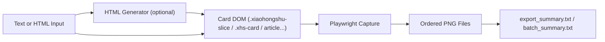

# text-to-social-image-skill

Text-first pipeline for turning long-form content into post-ready image cards.

## Abstract / 摘要

`text-to-social-image-skill` is a lightweight publishing pipeline that converts uploaded text or HTML into ordered PNG slices for social platforms.

`text-to-social-image-skill` 是一个轻量级图文发布流水线：将用户上传的文本或 HTML 自动排版并导出为有序 PNG 切片，便于直接发布到社媒平台。

## Project Positioning / 项目定位

- **Input**: `.txt`, `.md`, `.html`, `.htm`
- **Core output**: ordered image slices (`001.png`, `002.png`, ...)
- **Primary users**: creators, content operators, educators, indie makers
- **Primary use cases**:
  - long text to carousel cards
  - HTML snapshot export
  - reproducible batch export for editorial workflows

## Quick Links

- Chinese documentation: [README_ZH.md](./README_ZH.md)
- English documentation: [README_EN.md](./README_EN.md)
- Skill trigger and usage: [SKILL.md](./SKILL.md)

## Key Features

- Text -> auto typeset HTML cards
- HTML -> ordered PNG export
- Batch HTML export (one folder per source file)
- Deterministic naming + export summaries
- Selector fallback for different HTML structures

## Architecture (Current)



## CLI

```bash
npm install

# Text -> HTML
node scripts/text-to-html.mjs --input ./examples/sample-input.txt --output ./out/sample.html --title "Title"

# HTML -> images
node scripts/html-to-images.mjs --input ./out/sample.html --outputDir ./out/sample_images

# Text -> images (one step)
node scripts/text-to-images.mjs --input ./examples/sample-input.txt --outputRoot ./out --title "Title"

# Batch HTML -> images
node scripts/batch-html-to-images.mjs --inputDir "C:/Users/you/Downloads" --outputRoot "C:/Users/you/Downloads/html_images_export"
```

## Output Contract

- Image names: `001*.png`, `002*.png`, ...
- Batch folders: `001_<name>`, `002_<name>`, ...
- Per-file summary: `export_summary.txt`
- Batch summary: `batch_summary.txt`

## Status

### Stable now

- Text to card-style HTML
- Ordered element-level screenshot export
- Batch export with deterministic ordering

### Planned next

- Auto title generation from txt/md
- Adaptive pagination strategy by content density
- Theme switch (`xiaohongshu` / `wechat`)
- Minimal drag-and-drop web UI

## Repository Structure

```text
.
├─ SKILL.md
├─ README.md
├─ README_ZH.md
├─ README_EN.md
├─ examples/
└─ scripts/
   ├─ text-to-html.mjs
   ├─ html-to-images.mjs
   ├─ text-to-images.mjs
   ├─ batch-html-to-images.mjs
   └─ lib/utils.mjs
```

## FAQ

1. Why only one image exported for some files?
- Your HTML may not use the default slice selector. Use `html-to-images.mjs` after ensuring card containers exist, or update selector priority in the script.

2. Why are links not extracted in bookmark generation scenarios?
- Some pages include site names only (no explicit URLs). In such cases, generate search-style bookmarks or enrich URLs with a resolver stage.

3. Is output deterministic?
- Naming and ordering are deterministic. Rendering differences may still occur across browser/runtime versions.

## Safety & Privacy

- The tool runs locally and does not upload input content by default.
- Review exported images before publishing.
- Avoid embedding secrets in source HTML/text.

## License

No explicit license is attached yet. Add one before public reuse outside personal/internal workflows.
